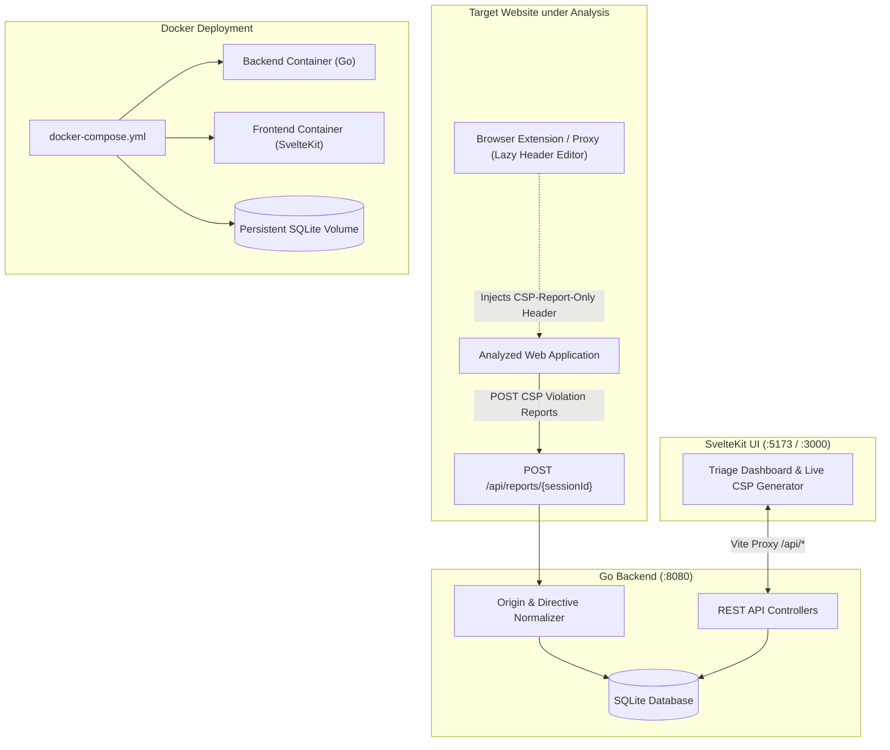

# CSP Report Collector & Policy Generator

A modern developer tool designed to capture Content Security Policy (CSP) violations reported by browsers running in `Content-Security-Policy-Report-Only` mode, inspect and triage blocked resources by directive and origin, and generate production-ready CSP rules.

---

## Key Features

- **Real-Time Report Ingestion**: Accepts legacy W3C CSP reports (`application/csp-report`), Reporting API v1 payloads (`application/reports+json`), and standard JSON.
- **Smart Origin Normalization**:
  - Automatically derives origin hosts (e.g. `https://api.example.com/v1/...` &rarr; `https://api.example.com`).
  - Deduces wildcard domain rules (e.g. `https://*.example.com`).
  - Matches session target origin to detect `'self'` candidates.
- **Interactive Triage Dashboard**:
  - Filter by directives (`connect-src`, `script-src`, `style-src`, `img-src`, etc.).
  - Instant triage actions: Approve Origin, Approve Wildcard, Mark `'self'`, Reject, or Ignore.
  - Drill-down evidence drawer inspecting raw occurrences, source scripts, and line numbers.
- **Live CSP Policy Generator**:
  - Multi-format compilation: HTTP Header, HTML `<meta>`, Nginx `add_header`, Apache `Header set`, and raw directives.
  - Redundant exact origins are cleaned up automatically when wildcard origins cover them.
  - Keywords (`'none'`, `'self'`, `'unsafe-inline'`, `'unsafe-eval'`) are automatically quoted.
  - Enforce vs Report-Only toggle.
- **Containerized or Local**:
  - Zero-dependency pure-Go SQLite backend with WAL mode concurrency.
  - Fast, responsive SvelteKit frontend styled with Tailwind CSS.

---

## Architecture & Data Flow



---

## Quick Start (Local Development)

### Prerequisites
- [Go](https://go.dev/) 1.26+
- [Node.js](https://nodejs.org/) 20+

### 1. Start the Backend API (:8080)
```bash
cd backend
go run ./cmd/server
```
The Go API will start on `http://localhost:8080` and initialize the SQLite database in `./data/csp_reports.db`.

### 2. Start the SvelteKit Frontend (:5173)
In another terminal:
```bash
cd frontend
npm install
npm run dev
```
Open your browser at `http://localhost:5173`. The Vite development server automatically proxies `/api` and `/health` requests to `http://localhost:8080`.

---

## Docker Deployment

To build and start both the backend and frontend using Docker Compose:

```bash
docker compose up --build -d
```

- **Frontend UI**: `http://localhost:3000`
- **Backend API**: `http://localhost:8080`
- **SQLite Database**: Persisted in the host `./data` directory.

To stop the containers:
```bash
docker compose down
```

---

## Browser Setup Guide

To capture CSP violations from a web application without modifying its server code:

1. Open the UI at `http://localhost:5173` (or `http://localhost:3000` under Docker) and create a **New Session** specifying your target web origin (e.g. `https://app.example.com`).
2. Copy the dedicated Report-URI generated for your session (e.g. `http://localhost:8080/api/reports/<session-id>`).
3. Using the **[Lazy Header Editor](https://chromewebstore.google.com/detail/lazy-header-editor-modify/pcmlilcdikmaadfkkjejdghnikdibakg)** browser extension (free, local, no ads, Manifest V3):
   - **Fastest (1-Click Import)**: In the session modal, click **Download Profile (.json)**, then in the extension click **⋮ (Menu)** &rarr; **Import profile**.
   - **Manual**:
     - Go to **Response Headers** &rarr; **+ Add header**:
       - **Header Name**: `Content-Security-Policy-Report-Only`
       - **Header Value**: `default-src 'none'; form-action 'none'; frame-ancestors 'none'; report-uri http://localhost:8080/api/reports/<session-id>;`
       - **Operation**: `Set`
     - In **Filter**, set URL pattern: `https://app.example.com/*`.
     - Toggle the master switch **ON**.
4. Reload the target web application. Blocked resource violations will instantly appear on your triage dashboard.

---

## REST API Reference

### Healthcheck
- `GET /health` &rarr; Returns `200 OK` with `{"status": "ok"}` for container liveness and orchestration probes.

### Report Ingestion
- `POST /api/reports/{sessionId}` (and alias `POST /{sessionId}`)
  - Ingests CSP violation payloads (`application/csp-report`, `application/reports+json`, `application/json`).
  - Automatically derives origin host, wildcard pattern, and `'self'` status, then upserts the violation group and stores the raw report.
  - Returns `204 No Content`.
- `OPTIONS /api/reports/{sessionId}` (and alias `OPTIONS /{sessionId}`)
  - Preflight CORS handler returning `204 No Content` with open CORS headers (`Access-Control-Allow-Origin: *`).

### Sessions Management
- `GET /api/sessions` &rarr; Lists all sessions with aggregate counts (`total_reports`, `pending_violations`, `approved_rules`, `self_violations`).
- `POST /api/sessions` &rarr; Creates a new session (`{ "name": "...", "target_origin": "https://...", "description": "..." }`). Returns `201 Created` with `Location: /api/sessions/{id}`.
- `GET /api/sessions/{id}` &rarr; Returns session details, metrics, and policy settings.
- `DELETE /api/sessions/{id}` &rarr; Deletes the session and cascades removal of all associated reports and violation groups (`204 No Content`).

### Violations & Triage
- `GET /api/sessions/{id}/violations` &rarr; Retrieves grouped violations with filtering:
  - Query parameters: `?directive=connect-src`, `?status=pending|approved_origin|approved_wildcard|approved_self|rejected|ignored`, `?search=example`, `?source=self|third_party`.
- `GET /api/sessions/{id}/violations/{violationId}/samples` &rarr; Returns recent raw report occurrences (document URI, source file, line/column numbers, script sample).
- `PATCH /api/sessions/{id}/violations/{violationId}` &rarr; Updates triage status for a violation (`{ "status": "approved_origin" | "approved_wildcard" | "approved_self" | "rejected" | "ignored" | "pending" }`).
- `POST /api/sessions/{id}/violations/bulk` &rarr; Bulk updates multiple violation statuses (`{ "violation_ids": [1, 2], "status": "approved_origin" }`).
- `POST /api/sessions/{id}/violations/approve-self` &rarr; Convenience endpoint to mark all pending `'self'` violations as `approved_self`.

### Policy Compilation & Settings
- `GET /api/sessions/{id}/policy` (and alias `GET /api/sessions/{id}/export`) &rarr; Compiles and exports the CSP policy:
  - Query parameter: `?format=raw|meta|nginx|apache` (omitting returns all formats in a JSON object).
- `PUT /api/sessions/{id}/settings` &rarr; Updates custom policy settings (`default_src`, `form_action`, `frame_ancestors`, `upgrade_insecure_requests`, `block_all_mixed_content`, `report_only`, `custom_directives`).

### Error Response Envelope
Standardized error format returned for 4xx/5xx responses:
```json
{
  "error": {
    "code": "NOT_FOUND",
    "message": "Session with id '...' not found",
    "details": null
  }
}
```

---

## Database Schema (SQLite)

The backend uses pure-Go embedded SQLite (`modernc.org/sqlite`) with WAL mode enabled (`PRAGMA journal_mode = WAL; PRAGMA foreign_keys = ON; PRAGMA busy_timeout = 5000;`) for high-concurrency report ingestion.

```sql
CREATE TABLE IF NOT EXISTS session (
    id TEXT PRIMARY KEY,               -- UUID
    name TEXT NOT NULL,
    target_origin TEXT NOT NULL,       -- e.g. "https://app.example.com"
    description TEXT,
    created_at DATETIME DEFAULT CURRENT_TIMESTAMP,
    updated_at DATETIME DEFAULT CURRENT_TIMESTAMP
);

CREATE TABLE IF NOT EXISTS raw_report (
    id INTEGER PRIMARY KEY AUTOINCREMENT,
    session_id TEXT NOT NULL,
    document_uri TEXT,
    referrer TEXT,
    violated_directive TEXT NOT NULL,
    effective_directive TEXT NOT NULL,
    original_policy TEXT,
    disposition TEXT,
    blocked_uri TEXT NOT NULL,
    line_number INTEGER,
    column_number INTEGER,
    source_file TEXT,
    status_code INTEGER,
    script_sample TEXT,
    created_at DATETIME DEFAULT CURRENT_TIMESTAMP,
    FOREIGN KEY(session_id) REFERENCES session(id) ON DELETE CASCADE
);

CREATE TABLE IF NOT EXISTS violation_group (
    id INTEGER PRIMARY KEY AUTOINCREMENT,
    session_id TEXT NOT NULL,
    directive TEXT NOT NULL,           -- e.g. "connect-src", "script-src"
    origin_host TEXT NOT NULL,         -- e.g. "https://api.example.com" or "data:"
    suggested_wildcard TEXT,           -- e.g. "https://*.example.com"
    is_self BOOLEAN DEFAULT 0,         -- 1 if origin matches session target_origin
    count INTEGER DEFAULT 1,
    last_seen_at DATETIME DEFAULT CURRENT_TIMESTAMP,
    status TEXT DEFAULT 'pending',     -- 'pending' | 'approved_origin' | 'approved_wildcard' | 'approved_self' | 'rejected' | 'ignored'
    UNIQUE(session_id, directive, origin_host),
    FOREIGN KEY(session_id) REFERENCES session(id) ON DELETE CASCADE
);

CREATE TABLE IF NOT EXISTS session_policy_setting (
    session_id TEXT PRIMARY KEY,
    default_src TEXT DEFAULT "'none'",
    form_action TEXT DEFAULT "'none'",
    frame_ancestors TEXT DEFAULT "'none'",
    upgrade_insecure_requests BOOLEAN DEFAULT 0,
    block_all_mixed_content BOOLEAN DEFAULT 0,
    report_only BOOLEAN DEFAULT 0,
    custom_directives TEXT DEFAULT '',
    FOREIGN KEY(session_id) REFERENCES session(id) ON DELETE CASCADE
);

CREATE INDEX IF NOT EXISTS idx_raw_report_session_id ON raw_report(session_id);
CREATE INDEX IF NOT EXISTS idx_violation_group_lookup ON violation_group(session_id, directive, status);
```

---

## Testing

### Backend Unit & Integration Tests
```bash
cd backend
go test -v ./...
```

### End-to-End Verification
With the backend running (`go run ./cmd/server`):
```bash
node scripts/test_e2e.mjs
```

### Frontend Production Build
```bash
cd frontend
npm run build
```
